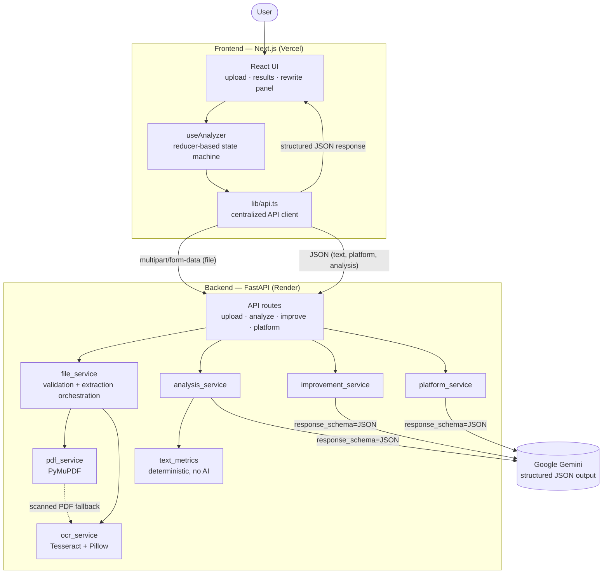

# postpilot.ai — Social Media Content Analyzer

**Upload a PDF or an image of a social media post. Get an engagement score, a structured critique, and an AI-rewritten, platform-tailored version — backed by deterministic text metrics you can verify yourself.**

---

## Table of Contents

1. [Problem Statement](#problem-statement)
2. [Features](#features)
3. [Demo / Hosted Application](#demo--hosted-application)
4. [Architecture](#architecture)
5. [Technology Stack](#technology-stack)
6. [Frontend Architecture](#frontend-architecture)
7. [Backend Architecture](#backend-architecture)
8. [PDF Extraction Approach](#pdf-extraction-approach)
9. [OCR Approach](#ocr-approach)
10. [AI Analysis Approach](#ai-analysis-approach)
11. [API Endpoints](#api-endpoints)
12. [Project Structure](#project-structure)
13. [Environment Variables](#environment-variables)
14. [Local Setup](#local-setup)
15. [Frontend Deployment](#frontend-deployment)
16. [Backend Deployment](#backend-deployment)
17. [Error Handling](#error-handling)
18. [Security Considerations](#security-considerations)
19. [Limitations](#limitations)
20. [Future Improvements](#future-improvements)
21. [Screenshots](#screenshots)

---

## Problem Statement

Writing an effective social media post is hard to self-assess: it's difficult to tell whether an opening line will stop a scroll, whether the tone fits the target platform, or whether a call to action is even present. Content also frequently exists first as a PDF export or a screenshot rather than as plain text, so any analysis tool first has to solve **extraction** before it can solve **critique**.

This project builds an end-to-end pipeline that takes a document exactly as a user has it — a PDF or an image — and turns it into:

1. **Extracted, readable text** (native PDF parsing, or OCR when the PDF is a scan or the input is an image)
2. **A structured engagement critique** (score, strengths, weaknesses, actionable suggestions, tone, sentiment, audience)
3. **Objective, reproducible text statistics** (word/sentence counts, reading time, a formula-based readability score)
4. **A platform-tailored, AI-rewritten version**, on request, that targets the specific weaknesses already identified

The system is split cleanly into what a deterministic algorithm can compute reliably (counts, reading time, Flesch readability) and what genuinely requires semantic judgement from a language model (sentiment, tone, engagement quality) — see [AI Analysis Approach](#ai-analysis-approach).

---

## Features

**Upload**
- Drag-and-drop or file-picker upload for PDF, PNG, and JPG
- Client-side validation (type, size) backed by server-side validation via file magic bytes — never trusts the filename or `Content-Type` header
- Selected-file preview with remove/replace

**Extraction**
- Native text extraction from digital PDFs via PyMuPDF, with paragraph structure reconstructed from positioned text blocks (not one flattened blob)
- Automatic detection of scanned PDFs (near-empty native text) with a fallback that rasterises pages and routes them through OCR
- OCR for image uploads via Tesseract, with Pillow-based pre-processing (greyscale, upscaling, contrast) and a reported per-document confidence score

**Analysis**
- AI-generated engagement critique: overall score, 7 sub-scores (hook, clarity, call to action, readability, emotional appeal, audience relevance, hashtag quality), tone, sentiment, inferred audience, strengths, weaknesses, and prioritised improvement suggestions
- Deterministic content metrics computed independently of the AI: character/word/sentence counts, average sentence length, estimated reading time, and a Flesch Reading Ease readability score with a plain-language level label

**Improve My Post**
- On-demand AI rewrite targeting the specific weaknesses already surfaced by analysis
- Platform selection (LinkedIn, Instagram, X, Facebook) with genuinely different tone/length/structure guidance per platform, not just a relabelled template
- Returns hook, body, call to action, recommended hashtags, and the fully assembled post

**Platform Optimization**
- Independent, per-platform fit assessment (a post can score well for LinkedIn and poorly for X on identical text)
- Recommended tone, length, hook, call to action, and hashtags for the selected platform
- Fetches automatically when the platform selection changes

**Reliability**
- Full loading states for every asynchronous step, with cancellation
- Duplicate-submission guards on every user action
- Graceful degradation: OCR or AI being unavailable is reported with a specific, actionable error — never a blank screen or a stack trace

---

## Demo / Hosted Application

| | URL |
|---|---|
| Frontend | [thepostpilotai.vercel.app](https://thepostpilotai.vercel.app) |
| Backend API | [social-media-content-analyzer-3m1e.onrender.com](https://social-media-content-analyzer-3m1e.onrender.com) |
| API docs (`/docs`) | [social-media-content-analyzer-3m1e.onrender.com/docs](https://social-media-content-analyzer-3m1e.onrender.com/docs) |

Frontend is deployed on Vercel; backend runs as a Docker web service on Render's free tier. The free tier spins down after inactivity, so the first request after idle can take up to ~50 seconds while the instance wakes up — subsequent requests are fast.

---

## Architecture



**Design principle:** extraction (PyMuPDF/Tesseract) and AI analysis (Gemini) are separate, independently failable stages. A user can extract text with the AI completely unavailable; the reverse never happens, since analysis always operates on already-extracted text.

---

## Technology Stack

### Frontend

| Technology | Version | Why |
|---|---|---|
| Next.js | 16 (App Router) | Server Components keep the marketing shell at zero shipped JavaScript; only the interactive analyzer hydrates |
| React | 19 | Required by Next.js 16 |
| TypeScript | strict mode | The API contract is defined as types first; a backend field change becomes a compile error, not a runtime surprise |
| Tailwind CSS | v4 (CSS-first config) | Design tokens live in `app/globals.css` and generate the utilities directly |
| shadcn/ui primitives | — | Copied into the repo (`components/ui/`), not imported as a package, so they can be edited freely; only 7 primitives are used |
| lucide-react | — | Icon set |

No state-management library, no data-fetching library, no chart library. Total runtime dependency count: 10 packages.

### Backend

| Technology | Version | Why |
|---|---|---|
| Python | 3.9+ | |
| FastAPI | 0.128 | Async-native, automatic OpenAPI docs, Pydantic-validated request/response models |
| Uvicorn | 0.39 | ASGI server |
| PyMuPDF (`fitz`) | 1.26 | PDF text extraction with positional data (needed to reconstruct reading order) and page rasterisation for the OCR fallback |
| pytesseract + Tesseract OCR | 0.3.13 (wrapper) | OCR engine; the real binary is a separate system dependency, not a Python package |
| Pillow | 11.3 | Image pre-processing before OCR |
| google-genai | 1.47 | Official Gemini SDK, used for structured (schema-constrained) JSON output |
| Pydantic | 2.13 | Request/response validation and the AI response contract |

---

## Frontend Architecture

```
app/layout.tsx          Server Component — shell, fonts, header, footer
  └── app/page.tsx      Server Component — hero + feature copy (zero client JS)
        └── components/analyzer.tsx   ◄── the only meaningful client boundary
              │
              ├── hooks/use-analyzer.ts     the state machine (useReducer)
              │     └── lib/api.ts          the only file that calls fetch()
              │
              └── one of several screens, chosen by the current phase
```

**State machine, not scattered booleans.** `useAnalyzer` models the whole journey — file selection, extraction, AI analysis, platform optimization, and the on-demand rewrite — as a single `useReducer` with an explicit `phase` plus independent sub-states for the two optional AI steps (improve, platform optimization) that must not blank out the primary analysis if they fail.

**Two-request analysis, on purpose.** Uploading and analysing are one user action but two sequential network calls (`POST /api/upload` then `POST /api/analyze-text`) so the extracted text appears on screen immediately, rather than being withheld until the slower AI call finishes.

**Centralized API client.** `lib/api.ts` is the only file in the frontend that knows the backend exists. Every response is independently re-validated at runtime (TypeScript types vanish at build time) before it's trusted anywhere else in the app.

**Environment-driven backend URL.** The backend origin is read once from `NEXT_PUBLIC_API_URL` with no hardcoded fallback — a missing value fails loudly and explicitly rather than silently defaulting to `localhost` in production.

---

## Backend Architecture

```
app/
├── main.py       app creation, CORS, router registration, exception handlers
├── config.py     the only file that reads environment variables
├── api/          HTTP only — thin route handlers, no business logic
├── services/     business logic — no FastAPI imports, independently testable
├── schemas/      Pydantic request/response models (the wire contract)
└── utils/        file validation, the shared error vocabulary
```

**Stateless and file-free.** Every request is processed entirely in memory — PyMuPDF opens a PDF from a byte stream, Pillow decodes an image from a `BytesIO` buffer. Nothing uploaded is ever written to disk, which removes an entire class of bug (no cleanup to get wrong, nothing left behind if the process dies mid-request) and an entire class of security risk (no path traversal, nothing on disk that could be executed).

**Two contracts per AI feature, kept deliberately separate.** For each AI-backed capability there is an *AI-facing* schema (`schemas/ai_*.py`, snake_case, handed to Gemini as `response_schema`) and a *public* schema (`schemas/analysis.py`, camelCase, what the frontend receives). This lets prompt engineering and frontend field naming evolve independently.

**265 passing backend tests** (plus a separate, gated suite of 14 that exercise the real Gemini API when a key is present, subject to free-tier rate limits): PDF extraction correctness, OCR pipeline logic — mocked, and separately against a real Tesseract binary — the full HTTP contract for every endpoint, and deterministic-metrics accuracy.

---

## PDF Extraction Approach

A PDF has no native concept of a paragraph or even reliably a word — it is a set of drawing instructions placing glyphs at coordinates. `pdf_service.py`:

1. Extracts text in **block** mode from PyMuPDF, which groups nearby glyphs into positioned chunks
2. **Sorts blocks top-to-bottom, then left-to-right** to reconstruct human reading order — without this, a two-column layout would emit the entire right column before the left
3. Joins blocks with blank lines to preserve paragraph structure, fixes ligatures (`fi` → `fi`) and words hyphenated across a line break
4. **Detects scanned PDFs**: if the extracted text is near-empty relative to the page count, the PDF is assumed to be a scan (a single embedded image per page, not real text objects) and is rasterised page-by-page for the OCR fallback below

**Known limitation, documented and tested (not silently wrong):** PyMuPDF merges text sharing a baseline into a single block, so a two-column layout with both columns starting at the exact same vertical position can be misordered — the sort above only fixes the realistic multi-row case. This is covered by a `strict=True` `xfail` test rather than left undiscovered.

---

## OCR Approach

`ocr_service.py` handles both direct image uploads and the scanned-PDF fallback:

1. **Pre-processing** (Pillow): EXIF-orientation correction, alpha-channel flattening onto white (a transparent PNG would otherwise become black-on-black after greyscale conversion), greyscale conversion, upscaling images narrower than 1000px, and a contrast boost — accuracy is dominated by this step, not by the OCR engine itself
2. **Recognition** (Tesseract via pytesseract), using `image_to_data` rather than `image_to_string` so line and paragraph structure can be rebuilt from each word's block/paragraph/line indices, instead of returning one flattened string
3. **Confidence scoring**: Tesseract's per-word confidence values are averaged and returned to the client, with a UI warning below 75%

**Binary resolution**, in order: an explicit `TESSERACT_CMD` environment variable, then whatever `tesseract` resolves to on `PATH`, then a short list of standard install locations (`/opt/homebrew/bin`, `/usr/local/bin`, `/opt/local/bin`, `/usr/bin`) — covering both a normal Homebrew/apt install and a process started with a stripped `PATH`. A missing binary degrades to a clear `503 OCR_UNAVAILABLE`; it does not crash the service, and PDF extraction keeps working regardless.

---

## AI Analysis Approach

**Model:** Google Gemini (`gemini-3.6-flash` by default, configurable), chosen for its free tier and native structured-output support.

**Structured output over free text.** Every AI call sets `response_mime_type="application/json"` and `response_schema=<a Pydantic model>` — Gemini is constrained to emit JSON matching that shape at the model level. This is treated as *best-effort*, not a guarantee: the raw response is independently re-validated with Pydantic on receipt, which is the real correctness gate. A validation failure triggers exactly one retry with the specific error appended to the prompt; two consecutive failures return a clean `502 AI_RESPONSE_INVALID` rather than propagating a malformed object.

**Three independent AI services**, one per capability, each with its own system prompt and its own Gemini client:
- `analysis_service.py` — the general, platform-agnostic engagement critique
- `improvement_service.py` — the rewrite, grounded in the weaknesses/suggestions already identified so it fixes known problems rather than rewriting freely
- `platform_service.py` — platform-fit scoring and recommendations, injecting only the guidance for the one selected platform so the same text genuinely produces different advice per platform

**Deterministic where a formula suffices.** Word/character/sentence counts, average sentence length, reading time, and the readability score are computed in `text_metrics.py` — plain arithmetic and the Flesch Reading Ease formula, with zero AI or network dependency (enforced by a test that statically checks the module's imports). The same input always produces the same output, which is not true of anything the model returns. Note this produces **two different "readability" numbers** by design: the AI's holistic `scores.readability` judgement, and the formula-based `metrics.readabilityScore` — they can legitimately disagree, and the UI labels both explicitly to avoid the appearance of a bug.

**Anti-hallucination constraints**, enforced at the prompt level: the rewrite system prompt explicitly forbids inventing facts, statistics, or claims not present in the original text. This is a prompting discipline, not a computationally verified guarantee — no automated check can fully confirm "no invented facts" against arbitrary text.

**Failure handling.** Every Gemini SDK exception (`ClientError`, `ServerError`, timeout, or anything unexpected) is caught in one place per service and translated to `503 AI_UNAVAILABLE`. The real exception is logged server-side with full detail; the client never sees internals. No API key is ever configured — `is_available()` returns `false` — the AI endpoints fail immediately with a clear error, without attempting a network call.

---

## API Endpoints

All responses share one JSON envelope: `{"success": true, ...}` or `{"success": false, "error": {"code", "message", "hint"}}`.

| Method | Path | Body | Returns |
|---|---|---|---|
| `GET` | `/api/health` | — | Service status, Tesseract availability/version, AI availability/model |
| `POST` | `/api/upload` | multipart `file` | Extracted text only (no AI) |
| `POST` | `/api/analyze` | multipart `file` | Extraction **and** AI analysis in one call |
| `POST` | `/api/analyze-text` | `{ "text": string }` | AI analysis of text already extracted (used by the frontend, to avoid re-running OCR) |
| `POST` | `/api/improve` | `{ content, platform, analysis, instruction? }` | An AI-rewritten, platform-tailored post |
| `POST` | `/api/platform-analysis` | `{ text, platform }` | Platform-fit score and recommendations |

Interactive documentation is auto-generated by FastAPI at `/docs` on the running backend.

**Example — `POST /api/analyze-text`:**

```json
// Request
{ "text": "We just shipped our biggest update yet. Latency is down 60%." }

// Response (200)
{
  "success": true,
  "analysis": {
    "overallScore": 68,
    "scores": { "hook": 55, "clarity": 78, "callToAction": 10, "readability": 72,
                "emotionalAppeal": 60, "audienceRelevance": 65, "hashtagQuality": 45 },
    "tone": { "label": "Confident and informative", "descriptors": ["confident", "technical"] },
    "sentiment": { "label": "positive", "score": 0.42 },
    "audience": { "primary": "Software engineers", "segments": ["backend engineers"],
                  "readingLevel": "Professional / technical" },
    "strengths": [ { "id": "strength-1", "title": "Backed by a specific number", "detail": "..." } ],
    "weaknesses": [ { "id": "weakness-1", "title": "No closing call to action", "severity": "high", "detail": "..." } ],
    "suggestions": [ { "id": "suggestion-1", "title": "Add a direct question", "severity": "high",
                        "detail": "...", "example": "What's the hardest migration you've shipped?" } ],
    "metrics": { "characterCount": 60, "wordCount": 11, "sentenceCount": 2,
                 "avgWordsPerSentence": 5.5, "readingTimeSeconds": 3,
                 "readabilityScore": 78.2, "readabilityLevel": "Easy to read" }
  }
}
```

---

## Project Structure

```
social-media-content-analyzer/
├── README.md                    ← this file
├── frontend/
│   ├── app/                     Next.js App Router pages, layout, error boundary
│   ├── components/
│   │   ├── analysis/            result cards (score, findings, metrics, rewrite, platform)
│   │   ├── upload/               drag-and-drop zone, file preview
│   │   ├── states/               loading and error states
│   │   ├── common/                shared building blocks (SectionCard, CopyButton...)
│   │   └── ui/                   shadcn/ui primitives
│   ├── hooks/use-analyzer.ts     the client state machine
│   ├── lib/                     api.ts, config.ts, errors.ts, format.ts, labels.ts
│   ├── types/analysis.ts         the frontend's copy of the API contract
│   └── README.md                 frontend-specific setup and architecture notes
│
└── backend/
    ├── app/
    │   ├── main.py                app wiring, CORS, exception handlers
    │   ├── config.py              environment configuration
    │   ├── api/                  upload.py, analyze.py, improve.py, platform.py, health.py
    │   ├── services/              file_service, pdf_service, ocr_service,
    │   │                          analysis_service, improvement_service,
    │   │                          platform_service, text_metrics
    │   ├── schemas/               analysis.py (public), ai_*.py (AI-facing)
    │   └── utils/                 file_validation.py, errors.py
    ├── tests/                     265 passing tests: unit, HTTP contract, and a gated real-API suite
    └── README.md                  backend-specific setup and architecture notes
```

---

## Environment Variables

### Frontend (`frontend/.env.local`)

| Variable | Required | Default | Purpose |
|---|---|---|---|
| `NEXT_PUBLIC_API_URL` | **Yes** | none | Backend origin, no trailing slash. No hardcoded fallback by design. |
| `NEXT_PUBLIC_MAX_FILE_SIZE_MB` | No | `10` | Client-side upload guardrail; should match the backend's limit. |

### Backend (`backend/.env`)

| Variable | Required | Default | Purpose |
|---|---|---|---|
| `CORS_ALLOW_ORIGINS` | No | `http://localhost:3000` | Comma-separated allowlist of browser origins. |
| `MAX_FILE_SIZE_MB` | No | `10` | Upload size cap, enforced while streaming. |
| `MAX_OCR_PAGES` | No | `10` | Cap on pages rendered + OCR'd from a scanned PDF. |
| `TESSERACT_CMD` | No | *(blank)* | Explicit path to the Tesseract binary; leave blank unless needed. |
| `OCR_LANGUAGE` | No | `eng` | Tesseract language pack. |
| `GEMINI_API_KEY` | For AI features | *(blank)* | **Backend only** — never sent to the frontend or included in any response. |
| `GEMINI_MODEL` | No | `gemini-3.6-flash` | Any current Gemini model supporting structured JSON output. |
| `AI_MAX_INPUT_CHARS` | No | `6000` | Text is truncated to this length before being sent to the model. |
| `AI_TIMEOUT_SECONDS` | No | `30` | Hard deadline for one AI call. |
| `DEBUG` | No | `false` | Verbose logging. Never enable in production. |

Without `GEMINI_API_KEY`, `/api/upload` (extraction only) still works; every AI-backed endpoint returns `503 AI_UNAVAILABLE`.

---

## Local Setup

**Prerequisites:** Node.js 18+, Python 3.9+, [Tesseract OCR](https://github.com/tesseract-ocr/tesseract), and a free [Gemini API key](https://aistudio.google.com/apikey) (optional — only needed for AI features).

```bash
# macOS
brew install tesseract
```

### Backend

```bash
cd backend
python3 -m venv .venv
source .venv/bin/activate
pip install -r requirements.txt
cp .env.example .env
# edit .env and add your GEMINI_API_KEY, if you have one
uvicorn app.main:app --reload --port 8000
```

Verify: `curl http://127.0.0.1:8000/api/health` — `tesseractAvailable` and `aiAvailable` confirm both dependencies are wired up correctly.

### Frontend

```bash
cd frontend
npm install
cp .env.example .env.local
# edit .env.local: NEXT_PUBLIC_API_URL=http://127.0.0.1:8000
npm run dev
```

Open `http://localhost:3000`.

### Running the backend test suite

```bash
cd backend
pytest                              # full suite, mocked AI boundary, no key required
pytest tests/test_ai_end_to_end.py  # real Gemini calls; requires GEMINI_API_KEY, subject to free-tier rate limits
```

---

## Frontend Deployment

**Recommended: Vercel.**

1. Import the repository into Vercel, with the frontend's **root directory set to `frontend/`**
2. Set the environment variable `NEXT_PUBLIC_API_URL` to the deployed backend's URL
3. Deploy

Vercel auto-detects the Next.js App Router and requires no additional configuration. Note that `NEXT_PUBLIC_*` variables are inlined at **build** time — changing the variable after deployment requires a redeploy, not just a settings change.

---

## Backend Deployment

**Recommended: Render (or any host supporting a custom Docker image), not a plain Python buildpack.**

Tesseract OCR is a compiled system binary, not a Python package. A standard Python runtime will install `pytesseract` successfully and then fail at runtime with "tesseract is not installed" the first time an image is uploaded. The container image must install the binary itself — see [`backend/Dockerfile`](backend/Dockerfile), which installs `tesseract-ocr` via `apt-get` in a `python:3.11-slim` base alongside `pip install -r requirements.txt`.

Once deployed:

1. Set `CORS_ALLOW_ORIGINS` to the deployed frontend's exact origin (no trailing slash)
2. Set `GEMINI_API_KEY` for AI features
3. Confirm `GET /api/health` returns `tesseractAvailable: true` in the deployed environment — this is the single most common deployment failure for this project

---

## Error Handling

Every failure, from client-side validation through the deepest AI call, resolves to the same envelope: `{"success": false, "error": {"code", "message", "hint?"}}`. The frontend renders `message` and `hint` directly; it never displays a raw status code or a stack trace.

| Code | HTTP status | Cause |
|---|---|---|
| `BAD_REQUEST` | 400 | Malformed request, missing required field |
| `EMPTY_FILE` | 400 | Zero-byte upload |
| `FILE_TOO_LARGE` | 413 | Exceeds the configured size limit (checked while streaming, before buffering) |
| `UNSUPPORTED_FILE_TYPE` | 415 | File content (magic bytes) is not PDF/PNG/JPEG |
| `CORRUPTED_FILE` | 422 | File cannot be opened |
| `PASSWORD_PROTECTED` | 422 | Encrypted PDF |
| `NO_TEXT_FOUND` | 422 | Parsed successfully but contains no readable text |
| `OCR_UNAVAILABLE` | 503 | Tesseract binary missing; PDFs continue to work |
| `AI_UNAVAILABLE` | 503 | No API key configured, or the AI service is unreachable/erroring |
| `AI_RESPONSE_INVALID` | 502 | The AI answered, but its response failed validation twice |
| `SERVER_ERROR` | 500 | Unexpected — logged with a full traceback server-side, never exposed to the client |

**Frontend states covered for every asynchronous step:** idle, loading (with a cancel option), success, and error (with retry where the failure is transient). A failure at the AI-analysis step does not discard already-extracted text; a failure while generating a rewrite does not discard the analysis already on screen.

---

## Security Considerations

- **No file is ever written to disk.** PDFs and images are parsed entirely from in-memory byte streams, eliminating an entire class of path-traversal and cleanup-failure risk.
- **File type is decided by content (magic bytes), never by filename extension or the client-supplied `Content-Type` header** — both are attacker-controlled.
- **Upload size is enforced while streaming**, in 64KB chunks, so an oversized body is rejected after a few KB rather than being fully buffered first.
- **Filenames are reduced to a basename** before being echoed back in a response or written to a log.
- **CORS is an explicit origin allowlist, never `*`.** A wildcard would let any site script requests against the API from a visitor's browser and would abuse the OCR/AI compute budget of a free-tier deployment.
- **`GEMINI_API_KEY` is backend-only**, read once from the environment, never included in any API response, error message, or the auto-generated OpenAPI schema — verified by a dedicated regression test.
- **DoS guards:** a hard cap on pages rasterised from a single scanned PDF, and a Pillow decompression-bomb limit (~64 megapixels) on decoded images.
- **No stack trace ever reaches the client.** The catch-all exception handler logs the real error server-side and returns a generic message.

---

## Limitations

Stated plainly, not omitted:

- **Free-tier hosting.** The backend runs on Render's free tier, which spins down after inactivity — the first request after idle can take up to ~50 seconds.
- **Gemini free-tier quota is small** (20 requests/day per model at time of writing) and has not been load-tested; a production deployment would need a paid tier or aggressive caching.
- **PyMuPDF column-ordering edge case**: text in a two-column layout sharing an exact baseline can be extracted out of order. Documented and covered by a `strict` `xfail` test rather than silently wrong; the realistic multi-row case is unaffected.
- **Syllable counting for readability is heuristic** (vowel-group counting), not dictionary-based — standard practice for readability tools, but not linguistically exact.
- **Sentence splitting is a simple regex** on `. ! ?` with no special-casing for abbreviations ("Dr.", "e.g.") — a directional metric, not a parser.
- **No persistence.** Nothing is stored; refreshing the page loses all results. There is no history, no accounts, no saved documents.
- **Single file per request.** No batch upload or multi-document comparison.
- **English-only OCR by default** (configurable via `OCR_LANGUAGE`, but only one language at a time).
- **Anti-hallucination in the rewrite is prompt-enforced, not computationally verified** — there is no automated fact-check against the source text.
- **No automated frontend test suite.** The frontend is verified via TypeScript's strict mode, production builds, and manual/browser-driven testing during development; there is no Jest/Playwright suite committed to the repository.
- **Gemini model names can be deprecated without notice** by Google — this happened once during development (`gemini-2.0-flash` was removed server-side) — so `GEMINI_MODEL` may need updating over time.

---

## Future Improvements

- Write the backend `Dockerfile` and complete a live deployment (Render + Vercel)
- Word-level PDF text extraction to resolve the same-baseline column-ordering limitation
- A committed automated frontend test suite (component and integration tests)
- Batch upload and side-by-side comparison across multiple documents
- Persisted history (would require authentication and a database — a deliberate scope decision to omit for this assessment)
- Caching identical analysis requests to reduce AI API usage
- CI pipeline running the backend test suite and frontend build on every push
- Additional platforms (TikTok, Threads) and multi-language OCR support

---

## Screenshots

> Screenshots have not yet been captured for this README. To add them: run the app locally per [Local Setup](#local-setup), capture the states below, save them under `docs/screenshots/`, and reference them here.

| Screen | Description |
|---|---|
| Upload | Drag-and-drop / file-picker empty state |
| Extraction | Extracted text shown while AI analysis is still in progress |
| Analysis results | Engagement score, breakdown, strengths, weaknesses, suggestions |
| Content metrics | Deterministic readability card |
| Improve My Post | Platform selector, instruction field, generated rewrite |
| Platform optimization | Per-platform fit score and recommendations |
| Error state | An example of a handled failure with a retry action |
